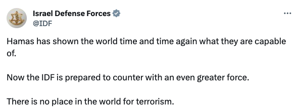
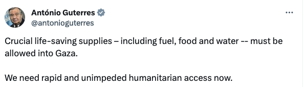

# Sentiment Analysis on tweets about the latest conflict in Gaza Strip 🇮🇱🇵🇸

Taking into account opinions and statements about the most recent conflict in Gaza Strip published on ~~Twitter~~ X, along with the advances in the development of deep learning models capable of performing textual categorization, this work developed a series of experiments that we to evaluate the performance of these approaches in the task of evaluating support bias (pro-Israel and pro-Palestine) in tweets published in X about the war between Israel and Hamas.

## Dataset 🗄️
To carry out the training and evaluation of the sentiment analysis models, 220 tweets were collected on X published from October 7, 2023, whose content discusses the war between Israel and Hamas. These tweets were labeled according to their support bias into pro-Israel and pro-Palestine. For ethical reasons, texts mentioning support for Hamas' terrorist actions were not added to the dataset.

Messages in support of Israel in the conflict were mostly collected from:
- [State of Israel's official Twitter account](https://twitter.com/Israel)
- [Official twitter channel of Israel's Ministry of Foreign Affairs](https://twitter.com/IsraelMFA)
- [Official Twitter account of the Office of the Prime Minister of Israel](https://twitter.com/IsraeliPM)
- [Official Israel Defense Forces Twitter account](https://twitter.com/IDF)
- [The official Twitter account of the Embassy of Israel to the United States](https://twitter.com/IsraelinUSA)

Messages in support of Palestine in the conflict were mostly collected from:
- [António Guterres, secretary-general of the UN, official Twitter account](https://twitter.com/antonioguterres)
- [Muhammad Smiry, a palestinian who tweets from Gaza during the war, twitter account](https://twitter.com/MuhammadSmiry)
- [Shahd Abusalama, a palestinian activist, twitter account](https://twitter.com/ShahdAbusalama)
- [Zachary Foster, a palestinian historian and journalist, twitter account](https://twitter.com/_ZachFoster)
- [Mondoweiss, an independent news portal for people taking action for Palestine](https://twitter.com/Mondoweiss)

After collecting and labeling the tweets, the dataset was then divided between the training set and the test set in a proportion of 90% and 10% respectively.

### Augmentation with `nplaug`

Due to pricing changes in X's API the data was collected manually, so to increase the dataset size [`nplpaug`](https://github.com/makcedward/nlpaug) was used - specifically the `ContextualWordEmbsAug` augmenter with [BERT](https://huggingface.co/docs/transformers/model_doc/bert).

Both original and augmented dataset are available in the `data` directory.

## Environment 🏞️
This project essentially uses [`Tensorflow`](https://www.tensorflow.org/). So if you want to run it locally, an environment with python's data science base packages (`numpy`, `pandas`, `scikit-learn` and `matplotlib`) and Tensorflow should be enough. Unless you're also trying to run the data augmentation then you should follow `nlpaug` installation instructions (that would require [PyTorch](https://pytorch.org/) and [`transformers`](https://github.com/huggingface/transformers) and to locally download BERT).